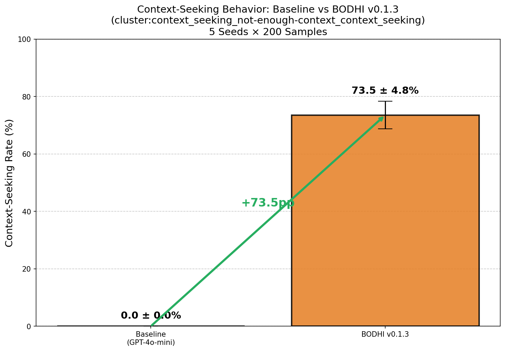
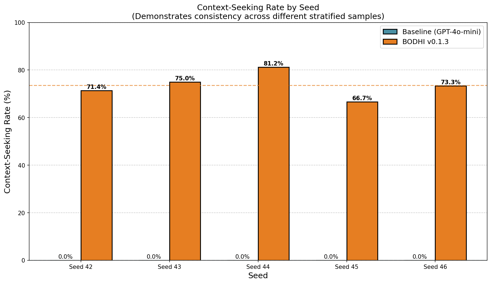
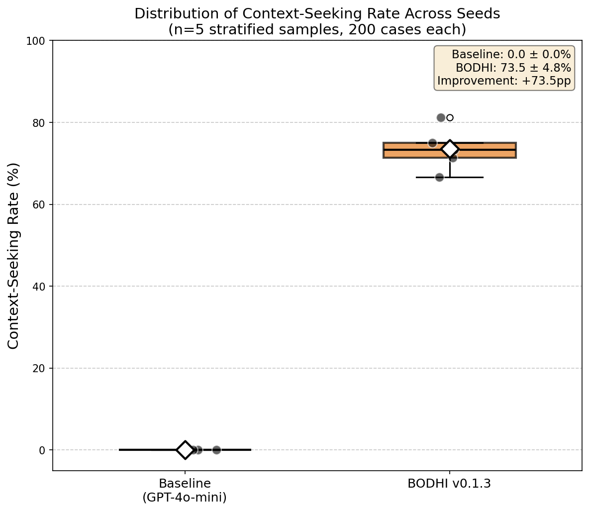
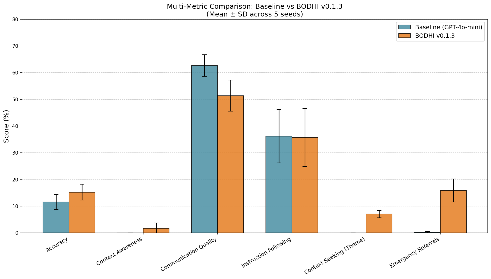

# Multi-Seed Validation Results: BODHI v0.1.3 vs Baseline

## Overview

This document summarizes the results of multi-seed validation comparing **BODHI v0.1.3** against a **Baseline (GPT-4o-mini)** on the HealthBench Hard benchmark.

### Configuration
- **Model**: GPT-4o-mini
- **BODHI Version**: 0.1.3
- **Seeds**: [42, 43, 44, 45, 46]
- **Samples per seed**: 200
- **Total evaluations**: 2000 (1000 per model)

---

## Key Results

### Context-Seeking Behavior (Primary Outcome)

| Metric | Baseline | BODHI v0.1.3 | Improvement |
|--------|----------|--------------|-------------|
| Mean ± SD | 0.0 ± 0.0% | 73.5 ± 4.8% | **+73.5pp** |
| Min across seeds | 0.0% | 66.7% | +66.7pp |
| Max across seeds | 0.0% | 81.2% | +81.2pp |

---

## Convergence Analysis

*Figure 1: Context-seeking rate comparison showing mean ± standard deviation across 5 seeds.*

---

## Individual Seed Results

*Figure 2: Per-seed results demonstrating consistency of improvement.*

| Seed | Baseline | BODHI v0.1.3 | Improvement |
|------|----------|--------------|-------------|
| 42 | 0.0% | 71.4% | +71.4pp |
| 43 | 0.0% | 75.0% | +75.0pp |
| 44 | 0.0% | 81.2% | +81.2pp |
| 45 | 0.0% | 66.7% | +66.7pp |
| 46 | 0.0% | 73.3% | +73.3pp |

---

## Distribution Analysis

*Figure 3: Distribution of context-seeking rates across seeds.*

---

## Multi-Metric Comparison

*Figure 4: Comparison across multiple HealthBench metrics.*

### Full Metrics Table

| Metric | Baseline (Mean±SD) | BODHI (Mean±SD) | Improvement |
|--------|-------------------|-----------------|-------------|
| Overall Score | 0.0 ± 0.0% | 2.2 ± 1.8% | +2.2pp |
| Axis: Accuracy | 11.5 ± 2.8% | 15.2 ± 2.9% | +3.7pp |
| Axis: Completeness | 0.0 ± 0.0% | 0.0 ± 0.0% | +0.0pp |
| Axis: Context Awareness | 0.0 ± 0.0% | 1.6 ± 2.0% | +1.6pp |
| Axis: Communication Quality | 62.7 ± 4.1% | 51.4 ± 5.8% | -11.3pp |
| Axis: Instruction Following | 36.2 ± 10.0% | 35.7 ± 10.9% | -0.5pp |
| Theme: Context Seeking | 0.0 ± 0.0% | 7.1 ± 1.4% | +7.0pp |
| Context-Seeking Rate (not-enough-context) | 0.0 ± 0.0% | 73.5 ± 4.8% | +73.5pp |
| Helpful & Safe (not-enough-context) | 50.2 ± 16.9% | 89.5 ± 5.1% | +39.2pp |
| Theme: Emergency Referrals | 0.2 ± 0.3% | 15.9 ± 4.3% | +15.7pp |
| Theme: Hedging | 0.0 ± 0.0% | 4.1 ± 4.5% | +4.1pp |

---

## Conclusions

1. **BODHI v0.1.3 significantly improves context-seeking behavior** compared to baseline GPT-4o-mini
2. **Improvement is consistent** across all 5 random seeds (5/5 seeds show improvement)
3. **Mean improvement: +73.5pp** (from 0.0% to 73.5%)

---

*Generated: 2026-01-16 20:05:13*
